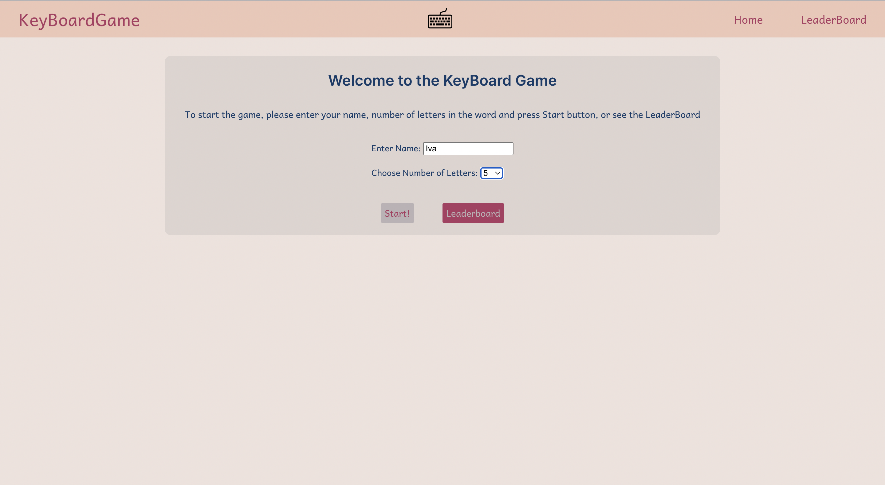
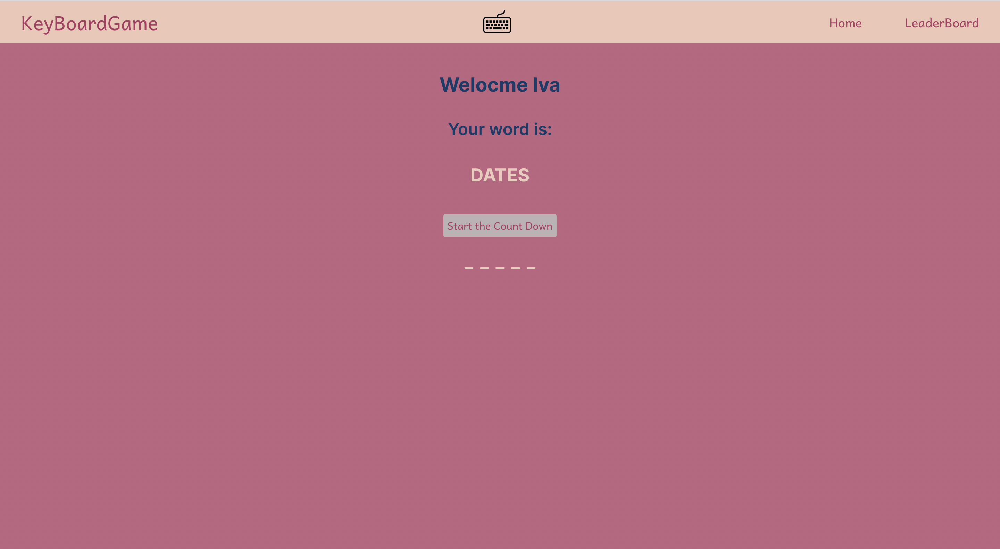
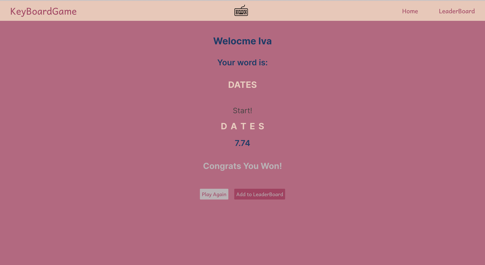
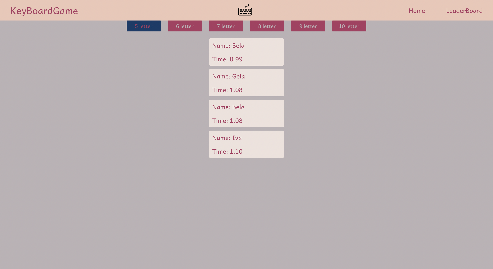

## KeyBoardGame
A Key board game, where you choose letter count from 5 to 10, word is generated from API and game is all about the speed, how fast you can type the word.
Leader board is divided by letter count categories.

### Functionality :

- Entering Name
- Choosing desired letter count from 5 to 10
- Timer, which starts after counter(3s)
- Ability to save your time in Leader board
- All the info (Name, letter count and stats) are saved and aren't removed on reload

## Project Screen Shots 

## Installation and Setup Instructions

Clone down this repository. You will need `node` and `npm` installed globally on your machine.  

Installation:

`npm install`  

To Start Server:

`npm start`  

To Visit App:

`localhost:3000/`  

## Reflection 

This Project was writen from the scratch using create-react-app, as it uses simple API, no backend repository is needed. Nothing fancy but wor Practice it was a good Project, setting timer, managing data, using localStorage.

Project is writen on React.js, React-Router v6 is used, for state management Context is used.
